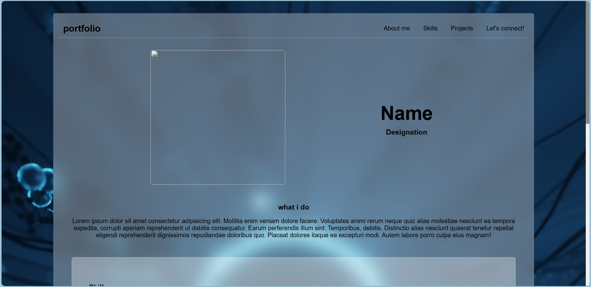
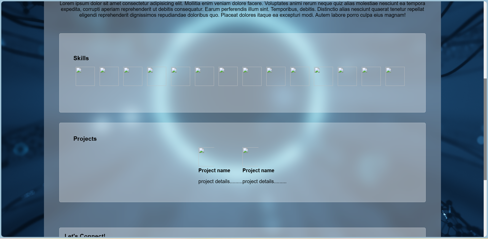
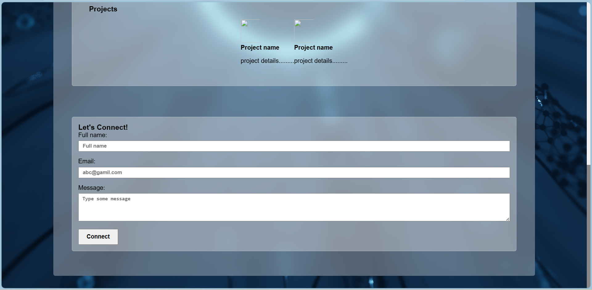

Single Page Portfolio template

## Overview  
This repository contains the source code for a developer portfolio website. It showcases essential details about the developer, including their skills, projects, and ways to connect. The website features a clean, responsive design with smooth navigation and visually appealing glass morphism elements.  

## Features  
- **Responsive Design:** Works seamlessly across various screen sizes.  
- **Glass Morphism Effect:** Enhances the visual appeal with modern design aesthetics.  
- **Skills Section:** Displays key skills with icons and hover effects.  
- **Project Showcase:** Highlights projects with descriptions and images.  
- **Contact Form:** Enables visitors to connect via a simple form.  
- **Smooth Scrolling:** Improves user experience with smooth navigation between sections.  

## Technologies Used  
- **HTML5** and **CSS3** for structure and styling.  
- **Responsive Design Principles** for mobile-first development.  
- **Glass Morphism Effect** for modern UI design.  

## Installation and Setup  
1. Clone the repository:  
   ```bash  
   git clone https://github.com/kartho1048/portfolio-dev-version.git  
2. Navigate to the project directory
3. Open index.html in your preferred browser.
4. Ensure the Images folder is in the same directory for assets to load correctly.

## Usage
- Use this portfolio template to create your own developer website.
- Replace placeholder content (e.g., profile image, name, skills, and project details) with your information.
- Customize styles in style.css to reflect your personal branding.

## Screenshots





## Contribution
Contributions are welcome! If you have suggestions or improvements, feel free to open an issue or submit a pull request.

## Acknowledgement
Special thanks to the open-source community for inspiration and resources that helped shape this portfolio design.
